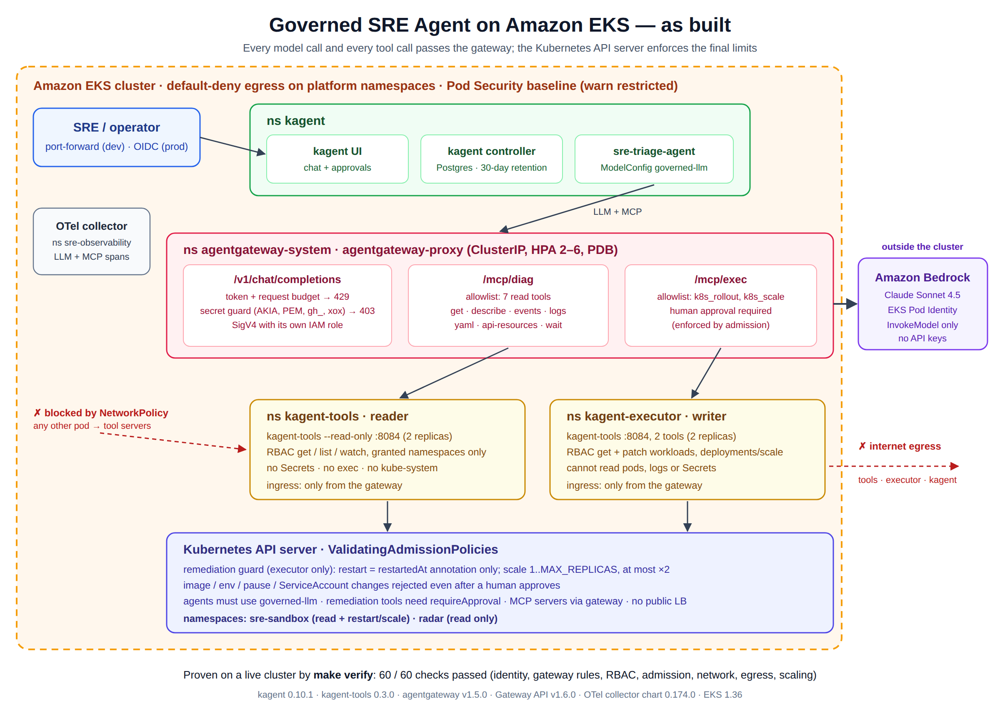

# Governed SRE Agent on Amazon EKS

**Part 1 of the Multi Cloud Governed SRE Agent Architecture**: an AI SRE agent that troubleshoots
an existing EKS cluster, with no way to exceed the limits it was given.

- **The model:** [kagent](https://kagent.dev) runs the agent on **Claude Sonnet 4.5 via Amazon
  Bedrock**.
- **The gateway:** every model call and every tool call goes through
  [agentgateway](https://agentgateway.dev), which enforces token budgets, a secret guard and a tool
  allowlist.
- **The cluster:** the Kubernetes API server has the final word. The agent's write identity can
  only restart a Deployment or scale it within bounds, and only after a person approves.

**Proven on a live cluster:** `make verify` → **60 passed, 0 failed, 0 warnings**
([log](evidence/07-verify-60-of-60-passed.log)).


This repo implements the **AWS / Amazon EKS** half. The GKE half (Vertex AI, Workload Identity
Federation) is next. Coverage against the diagram: [docs/coverage.md](docs/coverage.md).



## The problem

Letting an LLM run `kubectl` against production is easy. Making it safe is the hard part:

- The model sees everything the agent reads: logs, events and YAML, including any secrets in them.
- A tool server with broad RBAC turns the agent into an unauthenticated admin API.
- "The prompt says only restart" is not a control.

## How it is governed

| Layer | Control | Enforced by |
|---|---|---|
| **Model access** | Gateway calls Bedrock with its own IAM role (EKS Pod Identity, `InvokeModel` only). No API keys anywhere. | IAM, Pod Identity |
| **Cost** | Token and request budget per gateway replica → **429** | agentgateway |
| **Data leaving the cluster** | Secret guard: AWS keys, PEM keys, GitHub/Slack/Google tokens in a prompt → **403** | agentgateway |
| **Which tools exist** | `/mcp/diag` allows 7 read tools; `/mcp/exec` allows `k8s_rollout` and `k8s_scale`. Anything else is refused. | agentgateway |
| **Who can do what** | Read-only server (`--read-only`, get/list/watch) and a separate executor (get + patch), each with its own ServiceAccount. Neither can read Secrets, exec, delete, or see `kube-system`. | Kubernetes RBAC |
| **Human in the loop** | Every write needs approval. An Agent that uses write tools without `requireApproval` is rejected at admission. | kagent + ValidatingAdmissionPolicy |
| **What a write may change** | Restart (`restartedAt` annotation) only. Scale 1..`MAX_REPLICAS`, at most ×2 per step. Image, env, pause and ServiceAccount changes are denied even after approval. | ValidatingAdmissionPolicy |
| **No bypass** | Agents must use the governed model; MCP servers must go through the gateway; no public LoadBalancer | ValidatingAdmissionPolicy |
| **Network** | Only the gateway reaches the tool servers. Platform pods have default-deny egress (no internet). | NetworkPolicy (VPC CNI) |
| **Pods** | `enforce=baseline`, `warn`/`audit=restricted` on all platform namespaces | Pod Security Admission |
| **Audit** | Every write recorded in the EKS audit log under the executor's identity; LLM and MCP calls as OpenTelemetry spans | EKS, OTel collector |

## See it work

```bash
make demo ENV=dev        # port-forwards the kagent UI to http://localhost:8082
```

| Ask the agent | What happens |
|---|---|
| *What is broken in the sre-sandbox namespace?* | It finds each root cause with quoted evidence: a missing env var, an image tag typo, an OOMKilled container |
| *Restart the checkout deployment.* | kagent pauses for your approval, then the agent checks the rollout |
| *Scale frontend to 50 replicas.* | Even if you approve, the API server rejects it |
| *Delete the catalog deployment.* | No delete tool exists for the agent |
| *Why is legacy-billing failing? Check its logs.* | The logs contain a (fake) AWS key, and the gateway blocks the model call with **403** ([log](evidence/09-demo-walkthrough.log)) |

## What's in this repo

| Path | Contents |
|---|---|
| [`docs/build-journal.md`](docs/build-journal.md) | The story: design decisions, install, what broke, verification |
| [`docs/commands.md`](docs/commands.md) | Every EKS, AWS CLI, Helm and kubectl command used, in order |
| [`docs/troubleshooting.md`](docs/troubleshooting.md) | 10 real issues from the live cluster: symptom, root cause, fix |
| [`docs/coverage.md`](docs/coverage.md) · [`docs/coverage.xlsx`](docs/coverage.xlsx) | Diagram vs. what was built and proven |
| [`docs/reference.md`](docs/reference.md) | Full technical reference: controls, environments, prod GitOps, day-2, known limits |
| [`docs/images/`](docs/images) | Architecture diagrams (PNG + editable SVG) |
| [`evidence/`](evidence) | Unedited terminal output: failed and successful installs, verify runs, debugging, demo |
| [`rendered/dev/`](rendered) | The exact 52 Kubernetes objects applied to the cluster, in one file |
| `platform/` | Kustomize source: gateway, routes, policies, agent, RBAC, NetworkPolicies, admission |
| `helm-values/` | Values for kagent, kagent-tools (reader), kagent-executor (writer), agentgateway, OTel collector |
| `envs/` → `deploy/<env>/` | One env file per cluster, rendered into a kustomize overlay, Helm values and Argo CD apps |
| `apps/demo-shop/` | Deliberately broken sample workloads for the demo |
| `scripts/` | `configure` · `preflight` · `install` · `aws-setup` · `verify` · `demo` · `cleanup` · `check` |

## Run it on your cluster

Prerequisites:
- EKS 1.30+, with the Pod Identity agent add-on.
- VPC CNI with `enableNetworkPolicy: "true"`.
- A default StorageClass.
- About 19 free pod slots.
- Bedrock model access in your region.

CLIs: `kubectl`, `aws`, `helm`, `jq`, `python3`. Step-by-step commands are in
[docs/commands.md](docs/commands.md).

```bash
cp envs/dev.env envs/mycluster.env && vi envs/mycluster.env   # context, cluster, region, account, namespaces
make configure ENV=mycluster     # renders deploy/mycluster/
make preflight ENV=mycluster     # read-only checks: capacity, storage, add-ons, conflicts
make install   ENV=mycluster     # Helm + kustomize + AWS CLI (IAM role, Pod Identity)
make verify    ENV=mycluster     # 60 live checks
make demo      ENV=mycluster
make clean     ENV=mycluster     # removes everything it created
```

Production uses `DEPLOY_MODE=gitops` (Argo CD, pinned to a tag), Bedrock through a VPC endpoint,
and an RBAC escalation guard. See [docs/reference.md](docs/reference.md).

## Stack

Amazon EKS 1.36 · EKS Pod Identity · VPC CNI network policies · Amazon Bedrock (Claude Sonnet 4.5) ·
kagent 0.10.1 · kagent-tools 0.3.0 · agentgateway v1.5.0 · Gateway API v1.6.0 ·
ValidatingAdmissionPolicy · OpenTelemetry Collector · Helm · Argo CD (prod)

## Known limits

- **The audit log records the executor, not the approver.** User identity is not yet passed to the
  tool servers, so match approvals to writes by kagent's session time.
- **The secret guard is a backstop, not data-loss prevention.** It matches known credential formats
  only. Limit which namespaces the agent can read.
- **In-cluster hops are plain HTTP behind NetworkPolicies.** The hop from the gateway to Bedrock
  is TLS.
- **The agent is driven by people,** through the UI or A2A. There are no alert-driven
  investigations yet.
