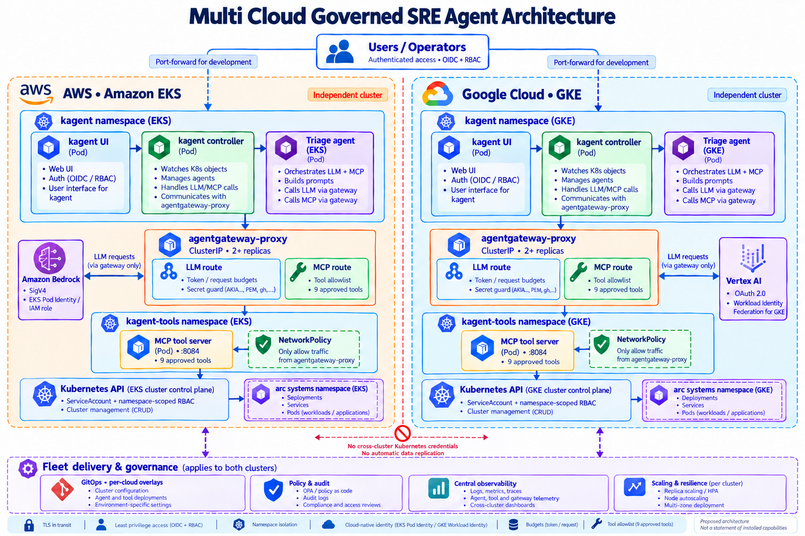

# Build journal: from diagram to 60/60 on a live EKS cluster

How the EKS half of the **Multi Cloud Governed SRE Agent Architecture** went from a diagram to a
verified deployment on an existing cluster (`ac-ws-dev-use2`, EKS 1.36, us-east-2).

## 1. Design: what "governed" has to mean

The diagram puts one agent in each cloud, with the model and every tool behind a gateway. Before
building, the design was challenged with about 80 review questions: blast radius, identity
propagation, prompt injection through logs, argument-level authorization, GitOps conflicts,
and degraded modes. Four decisions came out of that review:

1. **The gateway is not enough on its own.** agentgateway's MCP authorization sees the tool *name*,
   not its arguments. So "restart only" and "scale within limits" are enforced by the Kubernetes API
   server with ValidatingAdmissionPolicies, matched to the executor's identity only.
2. **Read and write are separate identities.** The diagram's single 9-tool MCP server became two:
   a `--read-only` diagnostics server (7 tools, get/list/watch) and an executor (2 tools, get +
   patch), each behind its own gateway route and allowlist.
3. **Every write needs a person.** `requireApproval` is set on the remediation tools, and an
   admission policy rejects any Agent that uses them without it.
4. **Evidence is untrusted.** Logs and events go to the model, so a secret guard on the LLM route
   blocks credentials before they leave the cluster.

## 2. Repository: one env file per cluster

- `envs/dev.env` and `envs/prod.env` are the only files edited per environment.
- `make configure` renders `deploy/<env>/`: a kustomize overlay, Helm values and Argo CD apps.
  It reads the live VPC CIDRs and API ClusterIP for the egress rules.
- Production rules are enforced at render time: GitOps only, pinned to a tag, no demo apps, egress
  lockdown on, Bedrock through a VPC endpoint.
- AWS resources come from an idempotent AWS CLI script (`aws-setup.sh`), with no Terraform.

## 3. Preparing the existing cluster

Checks in [commands.md §2](commands.md#2-check-that-the-cluster-is-ready):

- Kubernetes 1.36.
- Pod Identity agent and VPC CNI network policy enabled.
- Audit logs on.
- Bedrock `converse` returned "OK" for Claude Sonnet 4.5 through the `us.` inference profile.

The agent got its own namespace: `sre-sandbox` holds the deliberately broken demo apps, and the
existing `radar` namespace is read-only.

## 4. Install, and what the cluster taught

`make preflight` reported 0 blocking issues, but the install still hit four real-world problems
(details in [troubleshooting.md](troubleshooting.md)):

1. **Helm 4 server-side apply** rejected the kagent-tools chart's duplicate container port. Fixed by
   moving metrics to 8085.
2. **No default StorageClass:** kagent's Postgres PVC never bound, so the controller crash-looped.
   Fixed by adding the EBS CSI add-on and a `gp3` default StorageClass.
3. **"Too many pods":** t3.small nodes allow only 11 pods each. The nodes were self-managed, so a
   managed `t3.large` nodegroup was added after opening the security groups between old and new
   nodes.
4. **OTel chart deprecations:** components were renamed in the values.

Each became a preflight check or a values fix. The final install log is
[`04-install-success.log`](../evidence/04-install-success.log).

## 5. Verification

`make verify` runs 60 checks against the live cluster:

- the gateway reaching Bedrock with its own role;
- the secret guard and budget;
- exact tool counts per route, and direct calls to tools outside the allowlist refused;
- what each identity can and cannot do;
- the remediation guard as server-side dry runs;
- NetworkPolicy bypass attempts;
- internet egress from every platform namespace;
- Pod Security labels, admission policies, HPA, PDBs and retention.

The first runs exposed two weak tests (an egress race in VPC CNI standard mode, and tool discovery
timing) and one real defect. **One of the two gateway pods had started before its Pod Identity
credentials existed**, so about half of the model calls returned 500. `aws-setup.sh` now restarts
until every pod has credentials, and `verify` checks each pod.

Result: [**60 passed, 0 failed, 0 warnings**](../evidence/07-verify-60-of-60-passed.log).

## 6. The agent at work

`make demo` port-forwards the kagent UI and walks through four scenes:

1. **Triage:** "What is broken in the sre-sandbox namespace?" The answer should cover:
   - `checkout`: missing env var (from the logs);
   - `catalog`: image tag typo (from the events);
   - `recommender`: OOMKilled (from the last state);
   - `frontend`: healthy.
2. **Limits:** a restart waits for approval; scaling to 50 is rejected by the API server even after
   approval; image changes and deletes are not possible.
3. **Credential leak:** a pod logs a fake AWS key. The agent reads it, and the gateway blocks the
   next model call with a 403 (the `Guardrail` log line is in
   [`09-demo-walkthrough.log`](../evidence/09-demo-walkthrough.log)).
4. **Audit:** every executor write is in the EKS audit log under its own ServiceAccount.

The first triage hit **429 Too Many Requests**. That was the gateway's own budget doing its job,
but sized for chat, not for an agent loop that resends the whole conversation each step. The budget
is now a per-environment setting (400k tokens and 120 requests per minute per replica by default).

## 7. Coverage against the diagram

Everything inside the EKS box is built and proven. The fleet layer is partly done in dev. Details
are in [coverage.md](coverage.md) and [coverage.xlsx](coverage.xlsx).

## 8. Next

- **The GKE half:** Vertex AI with Workload Identity Federation, the same gateway policies.
- **Close the fleet gaps:** OIDC sign-in for the UI, a central OTLP backend, GitOps for dev,
  and node autoscaling.
